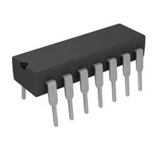
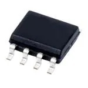

# Smart Curtain Subsystem Component Selection

## 1. 5V 1.5A Voltage Regulator (**Power Subsystem**)

### Option 1

| Solution | Pros | Cons |
|----------|------|------|
| **LM7805CT/NOPB**  Classic 5V linear regulator, widely used, easy to integrate Price: $1.80/each [Product Page](https://www.digikey.com/en/products/detail/texas-instruments/lm7805ct-nopb/3901929?_gl=1*1qyn9bn*_up*MQ..*_gs*MQ..&gclid=CjwKCAjw0sfHBhB6EiwAQtv5qdeTTWOp05cA6KonRds8dxN1djDoBjpO4AzG9BniGVk703AQC1o_YBoCs0UQAvD_BwE&gclsrc=aw.ds&gbraid=0AAAAADrbLlg0dPaLTWZbBCZYg4B1yAzaT) [Datasheet](https://www.ti.com/lit/ds/symlink/lm7800.pdf) | - Simple to use - Widely available - Low cost | - Inefficient - Generates heat - Limited input voltage range |

### Option 2

| Solution | Pros | Cons |
|----------|------|------|
| **TL780-05CKS**  5V linear regulator, low noise, robust, standard TO-220 package Price: $2.42/each [Product Page](https://www.digikey.com/en/products/detail/texas-instruments/TL780-05KCS/528597?gclsrc=aw.ds&gad_source=1&gad_campaignid=17922795960&gbraid=0AAAAADrbLlg0dPaLTWZbBCZYg4B1yAzaT&gclid=CjwKCAjw0sfHBhB6EiwAQtv5qdeTTWOp05cA6KonRds8dxN1djDoBjpO4AzG9BniGVk703AQC1o_YBoCs0UQAvD_BwE) [Datasheet](https://www.ti.com/lit/ds/slvs055m/slvs055m.pdf) | - Reliable - Low noise - Easy integration | - Heat generation - Less efficient - Requires heatsink at high current |

### Option 3

| Solution | Pros | Cons |
|----------|------|------|
| **Pololu S13V15F5**  5V step-up/step-down switching regulator, efficient, compact Price: $4.95/each [Product Page](https://www.pololu.com/product/4084) | - Energy-efficient - Compact - Wide input voltage range - Built-in protections | - More complex - Requires external components - Higher cost |

**Choice:** Option 3: Pololu S13V15F5  
**Rationale:** The Pololu S13V15F5 is a switching regulator, making it highly energy-efficient and reducing heat. Its wide input range ensures a stable 5V output from a 9V supply, protecting sensitive electronics. Although slightly more expensive and needing external components, its compact size and built-in protections make it ideal for the Smart Curtain subsystem.  

---

## 2. Operational Amplifier (**Control/Signal Subsystem**)

### Option 1

| Solution | Pros | Cons |
|----------|------|------|
| **LM358N**  Dual op-amp, widely used, low cost Price: $0.09/each [Product Page](https://www.digikey.com/en/products/detail/stmicroelectronics/LM358N/591694) [Datasheet](https://mm.digikey.com/Volume0/opasdata/d220001/medias/docus/1085/LM158%2C258%2C358.pdf) | - Low cost - Easy to use - Widely available | - Limited voltage range - Non-rail-to-rail - Lower precision |

### Option 2

| Solution | Pros | Cons |
|----------|------|------|
| **LM324N**  Quad op-amp, low cost, general-purpose Price: $0.47/each [Product Page](https://www.digikey.com/en/products/detail/texas-instruments/LM324N/277627) [Datasheet](https://www.ti.com/lit/ds/symlink/lm224.pdf?HQS=dis-dk-null-digikeymode-dsf-pf-null-wwe&ts=1760714829701) | - Quad op-amp - Low cost - Easy integration | - Limited voltage range - Non-rail-to-rail - Lower precision |

### Option 3

| Solution | Pros | Cons |
|----------|------|------|
| **TLV2372IDR**  Rail-to-rail I/O, low voltage, low power Price: $1.00/each [Product Page](https://www.mouser.com/ProductDetail/Texas-Instruments/TLV2372IDR?qs=WzgTT80quPHbp6isMOHsKA%3D%3D) [Datasheet](https://www.ti.com/lit/ds/symlink/tlv2372.pdf) | - Rail-to-rail input/output - Low power consumption - Accurate signal amplification | - Slightly higher cost - Limited output drive |

**Choice:** Option 3: TLV2372IDR  
**Rationale:** The TLV2372IDR provides rail-to-rail input/output, ensuring accurate amplification of low-voltage signals from sensors. Its low power consumption supports efficient operation, while cheaper op-amps risk inaccuracies. This choice ensures reliable sensor signal processing.  

---

## 3. Light Sensor (**Sensing Subsystem**)

### Option 1

| Solution | Pros | Cons |
|----------|------|------|
| **Adafruit LTR-329ALS-01** Digital ambient light sensor, I2C interface, wide dynamic range Price: $4.95/each [Product Page](https://www.adafruit.com/product/5591) [Datasheet](https://cdn-shop.adafruit.com/product-files/5591/LTR-329ALS-01-Lite-On-datasheet-140998467.pdf) | - I2C interface - Wide dynamic range - Low power consumption - Compact | - Requires I2C - Not suitable for direct sunlight - Limited response time |

### Option 2

| Solution | Pros | Cons |
|----------|------|------|
| **TSL2561FN** Digital light sensor, high resolution, I2C interface Price: $5.50/each [Product Page](https://www.digikey.com/en/products/detail/ams-osram-usa-inc/TSL2561FN/3095178?s=N4IgTCBcDaICoGUAyYCsA2AjAMQHIgF0BfIA) [Datasheet](https://mm.digikey.com/Volume0/opasdata/d220001/medias/docus/1169/TSL2560%2C61.pdf) | - High resolution - Accurate - I2C interface | - Higher cost - Slightly more complex integration |

### Option 3

| Solution | Pros | Cons |
|----------|------|------|
| **VEML7700-TT** High accuracy ambient light sensor, I2C interface Price: $1.24/each [Product Page](https://www.digikey.com/en/products/detail/vishay-semiconductor-opto-division/VEML7700-TT/6210690) [Datasheet](https://www.vishay.com/docs/84286/veml7700.pdf) | - Very high accuracy - Low power - I2C interface | - Expensive - More complex integration |

**Choice:** Option 1: Adafruit LTR-329ALS-01  
**Rationale:** The LTR-329ALS-01 is a digital I2C sensor with a wide dynamic range, ideal for indoor light sensing. It balances low power, ease of integration, and sufficient accuracy for Smart Curtain operation. Higher-end sensors are unnecessary for this application.  

---

## 4. Motion Sensor (**Sensing Subsystem**)

### Option 1

| Solution | Pros | Cons |
|----------|------|------|
| **LS6501LP PIR Motion Sensor** Pyroelectric infrared sensor, adjustable sensitivity and delay time Price: $2.95/each [Product Page](https://www.alldatasheet.com/datasheet-pdf/pdf/71304/LSI/LS6501LP.html) [Datasheet](https://cdn.thomasnet.com/ccp/00417955/110685.pdf) | - Low power - Adjustable sensitivity - Wide detection range - Easy integration | - Limited range - False triggers from pets or heat |

### Option 2

| Solution | Pros | Cons |
|----------|------|------|
| **Panasonic EKMB1101111** High-quality PIR sensor, compact, low power Price: $25.85/each [Product Page](https://www.digikey.com/en/products/detail/panasonic-electric-works/EKMB1101111/2601859?gclsrc=aw.ds&gad_source=1&gad_campaignid=17922795960&gbraid=0AAAAADrbLlg0dPaLTWZbBCZYg4B1yAzaT&gclid=CjwKCAjw0sfHBhB6EiwAQtv5qX6lGr1b0ZK4epyarS0EKLv1CeLmPG6pEGe2oNLX_Hw2_tth82XGtBoCTA0QAvD_BwE) [Datasheet](https://mm.digikey.com/Volume0/opasdata/d220001/medias/docus/2240/EKMB_MC_AMN2_3_Rev_Sep_2012.pdf?_gl=1*1lvusdm*_up*MQ..*_gs*MQ..&gclid=CjwKCAjw0sfHBhB6EiwAQtv5qX6lGr1b0ZK4epyarS0EKLv1CeLmPG6pEGe2oNLX_Hw2_tth82XGtBoCTA0QAvD_BwE&gclsrc=aw.ds&gbraid=0AAAAADrbLlg0dPaLTWZbBCZYg4B1yAzaT) | - Reliable detection - Compact - Low power | - Higher cost - More sensitive to false triggers |

### Option 3

| Solution | Pros | Cons |
|----------|------|------|
| **AM312 Mini PIR Sensor** Compact, low power, simple interface Price: $1.50/each [Product Page](https://www.alldatasheet.com/datasheet-pdf/pdf/1179499/ETC2/AM312.html) [Datasheet](https://www.image.micros.com.pl/_dane_techniczne_auto/cz%20am312.pdf) | - Very compact - Low cost - Low power | - Shorter range - Less reliable detection |

**Choice:** Option 1: LS6501LP PIR Motion Sensor  
**Rationale:** The  LS6501LP is chosen for its reliable motion detection, adjustable sensitivity, and wide detection range, which suit indoor environments. Its low cost and ease of integration with microcontrollers make it ideal for the Smart Curtain system.  

---

## 5. Button (**User Interface Subsystem**)

### Option 1

| Solution | Pros | Cons |
|----------|------|------|
| **PTS645SL43-2 LFS Tactile Switch** Basic push button, low cost, easy to integrate Price: $0.24/each [Product Page](https://www.digikey.com/en/products/detail/c-k/PTS645SL43-2-LFS/1146755) [Datasheet](https://www.ckswitches.com/media/1471/pts645.pdf) | - Very low cost - Easy to use | - Short lifespan - Less tactile feedback |

### Option 2

| Solution | Pros | Cons |
|----------|------|------|
| **Omron B3F Series Tactile Switch** High-quality tactile push button, reliable, long life Price: $0.24/each [Product Page](https://www.digikey.com/en/products/detail/omron-electronics-inc-emc-div/B3F-1000/33150) [Datasheet](https://omronfs.omron.com/en_US/ecb/products/pdf/en-b3f.pdf) | - Long lifespan (~1M presses) - Reliable actuation - Consistent tactile feel | - Slightly higher cost - Requires careful soldering |

### Option 3

| Solution | Pros | Cons |
|----------|------|------|
| **Adafruit Mini Tactile Switch** Compact, low profile, low cost Price: $0.75/each [Product Page](https://www.adafruit.com/product/367) [Datasheet](https://cdn-shop.adafruit.com/datasheets/B3F-1000-Omron.pdf) | - Compact - Low cost - Easy to use | - Shorter lifespan - Less tactile feel |

**Choice:** Option 2: Omron B3F Series Tactile Switch  
**Rationale:** The Omron B3F is durable (~1M presses) and provides reliable tactile feedback, making it suitable for frequent user interaction. Cheaper alternatives lack lifespan and consistent feel, which could degrade user experience over time.  

---

## 6. Red LED (**User Feedback Subsystem**)

### Option 1

| Solution | Pros | Cons |
|----------|------|------|
| **Kingbright WP710A10ND** Standard red LED, 5mm, bright, low power Price: $0.26/each [Product Page](https://www.digikey.com/en/products/detail/kingbright/WP710A10ND/3084190?gclsrc=aw.ds&gad_source=1&gad_campaignid=17922795960&gbraid=0AAAAADrbLlg0dPaLTWZbBCZYg4B1yAzaT&gclid=CjwKCAjw0sfHBhB6EiwAQtv5qUc3lQmFmMgkvqXCaZmnb6wYTc1j4LoG5FTrfJgctmm0AlTI1-mxChoCPLAQAvD_BwE) [Datasheet](https://www.kingbrightusa.com/images/catalog/SPEC/WP710A10ND.pdf) | - Low cost - Bright - Standard size - Easy soldering | - Requires current-limiting resistor - Fixed color |

### Option 2

| Solution | Pros | Cons |
|----------|------|------|
| **SSL-LX5093LID** High brightness LED, wide viewing angle Price: $0.33/each [Product Page](https://www.digikey.com/en/products/detail/lumex-opto-components-inc/SSL-LX5093LID/270908?gclsrc=aw.ds&gad_source=1&gad_campaignid=17922795960&gbraid=0AAAAADrbLlg0dPaLTWZbBCZYg4B1yAzaT&gclid=CjwKCAjw0sfHBhB6EiwAQtv5qfsbWJM7a5r5K-F3gK-GM6bE57YZ9llQlKydaoRa6sb_n4nqHZQzQRoC7osQAvD_BwE) [Datasheet](https://www.lumex.com/datasheet/files/SSL-LX5093LID.pdf) | - High brightness - Wide viewing angle | - Slightly higher cost - Requires resistor |

### Option 3

| Solution | Pros | Cons |
|----------|------|------|
| **Adafruit 5mm Red LED** Standard LED, low cost, easy to integrate Price: $0.12/each [Product Page](https://www.adafruit.com/product/299) | - Low cost - Easy integration - Standard size | - Slightly dimmer - Requires resistor |

**Choice:** Option 1: Kingbright WP710A10ND  
**Rationale:** This LED is bright, low-power, and standard size, making it easy to integrate as a status indicator. Its low cost and simplicity meet the Smart Curtain’s visual feedback requirements without unnecessary complexity.  

---

## 7. H-Bridge Motor Driver (**Actuation Subsystem**)

### Option 1

| Solution | Pros | Cons |
|----------|------|------|
| **L298N** Dual H-Bridge, high current, easy to find Price: $11.78/each [Product Page](https://www.digikey.com/en/products/detail/stmicroelectronics/L298N/585918) [Datasheet](https://www.st.com/content/ccc/resource/technical/document/datasheet/82/cc/3f/39/0a/29/4d/f0/CD00000240.pdf/files/CD00000240.pdf/jcr:content/translations/en.CD00000240.pdf) | - High current - Widely available - Simple | - Inefficient - Large size - Needs heat sink |

### Option 2

| Solution | Pros | Cons |
|----------|------|------|
| **TB6612FNG** Dual H-Bridge, 1.2A per channel, low voltage drop, efficient Price: $5.95/each [Product Page](https://www.pololu.com/product/713) [Datasheet](https://cdn.sparkfun.com/datasheets/Robotics/TB6612FNG.pdf) | - Efficient - Low voltage drop - Compact - Easy integration | - Lower current than L298N - Needs heat dissipation for higher loads |

### Option 3

| Solution | Pros | Cons |
|----------|------|------|
| **Pololu DRV8835** Dual H-Bridge, compact, efficient, low voltage drop Price: $3.95/each [Product Page](https://www.pololu.com/product/2135) [Datasheet](https://www.ti.com/lit/ds/symlink/drv8835.pdf?ts=1760734543680&ref_url=https%253A%252F%252Fwww.google.com%252F) | - Compact - Efficient - Low voltage drop | - Lower current - Slightly higher cost |

**Choice:** Option 2: TB6612FNG  
**Rationale:** The TB6612FNG offers efficient dual H-Bridge operation with low voltage drop, sufficient for the curtain motor. Its compact size and ease of integration make it preferable over the larger, less efficient L298N.  

---

## 8. Motor (**Actuation Subsystem**)

### Option 1

| Solution | Pros | Cons |
|----------|------|------|
| **Pololu 37D 12V DC Motor** Compact brushed DC motor, 12V, high torque, metal gearbox Price: $14.95/each [Product Page](https://www.pololu.com/product/1105) [Datasheet](https://www.pololu.com/file/0J1706/pololu-37d-metal-gearmotors.pdf) | - High torque - Compact size - Reliable performance | - Brushed motor (wear over time) - Requires motor driver |

### Option 2

| Solution | Pros | Cons |
|----------|------|------|
| **Pololu 25D 12V DC Motor** Smaller brushed DC motor, 12V, medium torque Price: $9.95/each [Product Page](https://www.pololu.com/product/4840) [Datasheet](https://www.pololu.com/file/0J1829/pololu-25d-metal-gearmotors.pdf) | - Medium torque - Compact - Lower cost | - Lower torque than 37D - Brushed motor - Needs motor driver |

### Option 3

| Solution | Pros | Cons |
|----------|------|------|
| **Nidec 12V DC Gear Motor** High-quality, compact DC motor with gearbox, long life Price: $19.50/each [Product Page](https://www.omc-stepperonline.com/fr/moteur-a-engrenages-cc-12v-brosse-3-5kg-cm-41rpm-90-1-boite-de-vitesses-droite-sgc37-32125000-g90) | - Affotdable - Compact - Moderate torque | - Lower RPM - Brushed design (wear) - Needs driver |

**Choice:** Option 1: Pololu 37D 12V DC Motor  
**Rationale:** The 37D motor provides high torque in a compact, reliable form factor, making it suitable for moving curtains efficiently. Its size and performance balance cost and durability better than the smaller or more expensive alternatives.  

---

## 9. 9V 3A Unregulated Power Supply (**Power Subsystem**)

### Option 1

| Solution | Pros | Cons |
|----------|------|------|
| **Mean Well GST40A09-P1J** 90W unregulated 9V DC power supply, high reliability Price: $17.30/each [Product Page](https://www.digikey.com/en/products/detail/mean-well-usa-inc/gst40a09-p1j/7703703) [Datasheet](https://www.meanwellusa.com/upload/pdf/GST40A/GST40A-spec.pdf) | - High reliability - Stable output - Protects circuits | - Bulkier - Expensive |

### Option 2

| Solution | Pros | Cons |
|----------|------|------|
| **DP4009N2M** C/DC desktop adapter, 9 V output, part of “DP40” 40 W series from Artesyn / Emerson (also marketed under DP4009N2M) Price: $35.12/each [Product Page](https://www.digikey.com/en/products/detail/artesyn-advanced-energy/DP4009N2M/2203577?utm_source=chatgpt.com) [Datasheet](https://mm.digikey.com/Volume0/opasdata/d220001/medias/docus/511/DP40_Series.pdf) | - Fully regulated 9 V output across wide AC input (90-264 VAC) - 40 W power capacity gives margin for 3 A requirement (9×3=27W) - Medical/ITE safeties, high quality external adapter design | - Less reliable - Desktop adapter form factor may be bulkier than slim wall plug-in form - Possibly higher cost for the spec, and may require external wiring (cord not included) |

### Option 3

| Solution | Pros | Cons |
|----------|------|------|
| **Mean‑Well SGA40E09‑P1J** Mean Well SGA40E09-P1J – 40W wall-mount (plug-in) AC/DC adapter, 9 V output, ~4.44 A max Price: $21.47/each [Product Page](https://www.mouser.com/ProductDetail/MEAN-WELL/SGA40E09-P1J?qs=kU9BrJCShyk7JuwjBVtOlQ%3D%3D&srsltid=AfmBOooYPFy-o8z2TKsX1w-nQ8iGEcE8ENDtLzemfdFMs3mg4elY-K3U&utm_source=chatgpt.com) [Datasheet](https://www.stathisnet.gr/image/SpecsUpload/028888.pdf?utm_source=chatgpt.com) | - Slim wall-mounted adapter (plug-in) form factor – simpler installation - 9 V × 4.44 A gives ~40W, plenty margin above 3 A requirement - High efficiency (reduces heat) and modern protections: Overcurrent, Overvoltage, Short-circuit built in | - Being plug-in, less modular for non-standard connector scenarios - Slightly higher cost compared to generic adapters - If input plug standard different (US vs EU), may require adapter or variant|

**Choice:** Option 1: Mean Well GST40A09-P1J  
**Rationale:** The Mean Well GST40A09-P1J provides a reliable and stable 9V 3A output, essential for powering the Smart Curtain subsystem safely. Its higher cost is justified by durability and protection features, which are crucial for continuous operation.  

---

## 10. 8-Pin Header Connector (**Interface Subsystem**)

### Option 1

| Solution | Pros | Cons |
|----------|------|------|
| **Samtec TSW-108-07-G-D** 8-pin male header, standard spacing, through-hole Price: $0.25/each [Product Page](https://www.digikey.com/en/products/detail/samtec-inc/TSW-108-07-G-D/1101269) [Datasheet](https://suddendocs.samtec.com/catalog_english/tsw_th.pdf) | - Low cost - Easy to solder - Standard pin spacing | - Limited current - Fixed pitch |

### Option 2

| Solution | Pros | Cons |
|----------|------|------|
| **Molex 5264-08** 8-pin header, gold plated, reliable connection Price: $0.60/each [Product Page](https://www.alldatasheet.com/datasheet-pdf/pdf/364145/MOLEX3/5264-08.html?utm_source=chatgpt.com) | - Gold plated - Reliable - Durable | - Higher cost - Slightly larger footprint |

### Option 3

| Solution | Pros | Cons |
|----------|------|------|
| **Adafruit 8-Pin Female Header** Compact, easy to connect/disconnect, low cost Price: $0.75/each [Product Page](https://www.peconnectors.com/female-headers-pcb-1x-row-.100/hws1362/?utm_source=googleads&vt_keyword=&gad_source=1&gad_campaignid=1362472447&gbraid=0AAAAAD-J6wS17LPjb4DfaKu2RGIc26OFa&gclid=CjwKCAjw0sfHBhB6EiwAQtv5qWFAyD4anpPkaR8ALUm5_ys46H4IrXHD41NiMca2cL0QQaZzhPHVhRoCa84QAvD_BwE) [Datasheet](https://media.digikey.com/pdf/Data%20Sheets/Adafruit%20PDFs/4156_Web.pdf?utm_source=chatgpt.com) | - Compact - Easy connection - Low cost | - Limited durability - Less secure connection |

**Choice:** Option 2: Molex 5264-08  
**Rationale:** The Molex 5264-08 is gold-plated and durable, providing reliable connectivity for repeated connections in the Smart Curtain subsystem. Although slightly more expensive than generic headers, its long-term reliability and secure fit justify the choice.  
