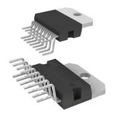

# Smart Curtain Subsystem Component Selection

## 1. 5V 1.5A Voltage Regulator (**Power Subsystem**)

### Option 1

| Solution | Pros | Cons |
|----------|------|------|
| **LM7805CT/NOPB**  Classic 5V linear regulator, widely used, easy to integrate Price: $1.80/each [Product Page](https://www.digikey.com/en/products/detail/texas-instruments/lm7805ct-nopb/3901929?_gl=1*1qyn9bn*_up*MQ..*_gs*MQ..&gclid=CjwKCAjw0sfHBhB6EiwAQtv5qdeTTWOp05cA6KonRds8dxN1djDoBjpO4AzG9BniGVk703AQC1o_YBoCs0UQAvD_BwE&gclsrc=aw.ds&gbraid=0AAAAADrbLlg0dPaLTWZbBCZYg4B1yAzaT) [Datasheet](https://www.ti.com/lit/ds/symlink/lm7800.pdf) | - Simple to use - Widely available - Low cost | - Inefficient - Generates heat - Limited input voltage range |

### Option 2

| Solution | Pros | Cons |
|----------|------|------|
| **TL780-05CKS**  5V linear regulator, low noise, robust, standard TO-220 package Price: $2.42/each [Product Page](https://www.digikey.com/en/products/detail/texas-instruments/TL780-05KCS/528597?gclsrc=aw.ds&gad_source=1&gad_campaignid=17922795960&gbraid=0AAAAADrbLlg0dPaLTWZbBCZYg4B1yAzaT&gclid=CjwKCAjw0sfHBhB6EiwAQtv5qdeTTWOp05cA6KonRds8dxN1djDoBjpO4AzG9BniGVk703AQC1o_YBoCs0UQAvD_BwE) [Datasheet](https://www.ti.com/lit/ds/slvs055m/slvs055m.pdf) | - Reliable - Low noise - Easy integration | - Heat generation - Less efficient - Requires heatsink at high current |

### Option 3

| Solution | Pros | Cons |
|----------|------|------|
| **Pololu S13V15F5**  5V step-up/step-down switching regulator, efficient, compact Price: $4.95/each [Product Page](https://www.pololu.com/product/4084) | - Energy-efficient - Compact - Wide input voltage range - Built-in protections | - More complex - Requires external components - Higher cost |

**Choice:** Option 1: LM7805CT/NOPB  
**Rationale:** The LM7805 linear voltage regulator is selected for its robust and straightforward design, making it a trusted option for providing a fixed 5V output in a variety of electronic designs. Its low cost, broad availability, and ease of integration allow for fast and reliable implementation. Built-in protection features (thermal shutdown and short-circuit protection) enhance reliability. While the regulator is less efficient and dissipates more heat compared to switching regulators, these drawbacks are acceptable given the manageable load and input-output differential in this application. With proper heatsinking for higher currents, the LM7805 is a proven and practical solution for the Smart Curtain subsystem’s stable 5V power requirement.

---

## 2. Motion Sensor (**Sensing Subsystem**)

### Option 1

| Solution | Pros | Cons |
|----------|------|------|
| **LS6501LP PIR Motion Sensor**  Pyroelectric infrared sensor, adjustable sensitivity and delay time Price: $2.95/each [Product Page](https://www.alldatasheet.com/datasheet-pdf/pdf/71304/LSI/LS6501LP.html) [Datasheet](https://cdn.thomasnet.com/ccp/00417955/110685.pdf) | - Low power - Adjustable sensitivity - Wide detection range - Easy integration | - Limited range - False triggers from pets or heat |

### Option 2

| Solution | Pros | Cons |
|----------|------|------|
| **Panasonic EKMB1101111**  High-quality PIR sensor, compact, low power Price: $25.85/each [Product Page](https://www.digikey.com/en/products/detail/panasonic-electric-works/EKMB1101111/2601859?gclsrc=aw.ds&gad_source=1&gad_campaignid=17922795960&gbraid=0AAAAADrbLlg0dPaLTWZbBCZYg4B1yAzaT&gclid=CjwKCAjw0sfHBhB6EiwAQtv5qX6lGr1b0ZK4epyarS0EKLv1CeLmPG6pEGe2oNLX_Hw2_tth82XGtBoCTA0QAvD_BwE) [Datasheet](https://mm.digikey.com/Volume0/opasdata/d220001/medias/docus/2240/EKMB_MC_AMN2_3_Rev_Sep_2012.pdf?_gl=1*1lvusdm*_up*MQ..*_gs*MQ..&gclid=CjwKCAjw0sfHBhB6EiwAQtv5qX6lGr1b0ZK4epyarS0EKLv1CeLmPG6pEGe2oNLX_Hw2_tth82XGtBoCTA0QAvD_BwE&gclsrc=aw.ds&gbraid=0AAAAADrbLlg0dPaLTWZbBCZYg4B1yAzaT) | - Reliable detection - Compact - Low power | - Higher cost - More sensitive to false triggers |

### Option 3

| Solution | Pros | Cons |
|----------|------|------|
| **AM312 Mini PIR Sensor**  Compact, low power, simple interface Price: $1.50/each [Product Page](https://www.alldatasheet.com/datasheet-pdf/pdf/1179499/ETC2/AM312.html) [Datasheet](https://www.image.micros.com.pl/_dane_techniczne_auto/cz%20am312.pdf) | - Very compact - Low cost - Low power | - Shorter range - Less reliable detection |

**Choice:** Option 1: LS6501LP PIR Motion Sensor  
**Rationale:** The  LS6501LP is chosen for its reliable motion detection, adjustable sensitivity, and wide detection range, which suit indoor environments. Its low cost and ease of integration with microcontrollers make it ideal for the Smart Curtain system.  

---

## 3. H-Bridge Motor Driver (**Actuation Subsystem**)

### Option 1

| Solution | Pros | Cons |
|----------|------|------|
| **L298N**  Dual H-Bridge, high current, easy to find Price: $11.78/each [Product Page](https://www.digikey.com/en/products/detail/stmicroelectronics/L298N/585918) [Datasheet](https://www.st.com/content/ccc/resource/technical/document/datasheet/82/cc/3f/39/0a/29/4d/f0/CD00000240.pdf/files/CD00000240.pdf/jcr:content/translations/en.CD00000240.pdf) | - High current - Widely available - Simple | - Inefficient - Large size - Needs heat sink |

### Option 2

| Solution | Pros | Cons |
|----------|------|------|
| **Fairchild FAN8100N**  Single H-Bridge, efficient, compact driver Price: $1.16/each [Product Page](https://www.digikey.com/en/products/detail/rochester-electronics-llc/FAN8100N/11558200?gclsrc=aw.ds&gad_source=1&gad_campaignid=120565755&gbraid=0AAAAADrbLlhGTyb62df9ti0P1sjNMH4jr&gclid=CjwKCAiAt8bIBhBpEiwAzH1w6ZgXZPSSU_kHKAA3JxQgLP8dpn8R68_7tV_7FHfo61rzrVuWnf3BvhoCdowQAvD_BwE) [Datasheet](https://rocelec.widen.net/view/pdf/1pizbjqffm/FAIRS23777-1.pdf?t.download=true&u=5oefqw) | - Very Efficient - Low heat generation - Good voltage range | - Only a single H-bridge - Lower max current (≈1 A continuous) depending on version |

### Option 3

| Solution | Pros | Cons |
|----------|------|------|
| **Pololu DRV8835**  Dual H-Bridge, compact, efficient, low voltage drop Price: $3.95/each [Product Page](https://www.pololu.com/product/2135) [Datasheet](https://www.ti.com/lit/ds/symlink/drv8835.pdf?ts=1760734543680&ref_url=https%253A%252F%252Fwww.google.com%252F) | - Compact - Efficient - Low voltage drop | - Lower current - Slightly higher cost |

**Choice:** Option 2: FAN8100N  
**Rationale:** I chose the FAN8100N because it gives me the efficiency and small size I need for this project. It doesn’t waste as much power as older drivers like the L298N, and it stays cooler without needing a heat sink.

Even though it’s a single H-bridge, it still works well for the motor setup in this project. It’s also one of the more affordable options, which is helpful for a student project with limited budget. 

---

## 4. Motor (**Actuation Subsystem**)

### Option 1

| Solution | Pros | Cons |
|----------|------|------|
| **Pololu 2371 (298:1 Micro Metal Gearmotor MP 6V)**  DC metal gearmotor, 6V, 298:1 gear ratio, 73 RPM no-load, 2.4 kg·cm stall torque Price: $23.95/each [Product Page](https://www.pololu.com/product/2371) [Datasheet](https://www.pololu.com/file/0J1487/pololu-micro-metal-gearmotors-rev-6-1.pdf) | - High gear ratio (298:1) for high torque at low speed - Extremely compact (10×12×25 mm) - Low weight (9.5 g) - Low current draw (0.07 A no-load, 0.67 A stall) - Reliable metal gearbox - Affordable | - Brushed motor (wear over time) - Requires motor driver - Lower RPM than larger motors - No encoder (open-loop control only) |

### Option 2

| Solution | Pros | Cons |
|----------|------|------|
| **Pololu 25D 12V DC Motor**  Smaller brushed DC motor, 12V, medium torque Price: $9.95/each [Product Page](https://www.pololu.com/product/4840) [Datasheet](https://www.pololu.com/file/0J1829/pololu-25d-metal-gearmotors.pdf) | - Medium torque - Compact - Lower cost | - Lower torque than 37D - Brushed motor - Needs motor driver |

### Option 3

| Solution | Pros | Cons |
|----------|------|------|
| **Nidec 12V DC Gear Motor**  High-quality, compact DC motor with gearbox, long life Price: $19.50/each [Product Page](https://www.omc-stepperonline.com/fr/moteur-a-engrenages-cc-12v-brosse-3-5kg-cm-41rpm-90-1-boite-de-vitesses-droite-sgc37-32125000-g90) | - Affotdable - Compact - Moderate torque | - Lower RPM - Brushed design (wear) - Needs driver |

**Choice:** Option 1: Pololu 2371 (298:1 Micro Metal Gearmotor MP 6V)
**Rationale:** The Pololu 2371 motor is selected for its exceptional compactness (10×12×25 mm), high gear ratio (298:1), and moderate stall torque (2.4 kg·cm), making it ideal for space-constrained applications like smart curtains. Its low weight (9.5 g) and low current draw (0.07 A no-load, 0.67 A stall) ensure minimal power consumption and easy integration into small subsystems. While it is a brushed motor (subject to wear over time), its reliability and affordability make it a practical choice for this project. The lack of an encoder is acceptable for open-loop control scenarios, and the motor's performance is well-matched to the requirements of moving lightweight curtains efficiently.   

---

## 5. 9V 3A Unregulated Power Supply (**Power Subsystem**)

### Option 1

| Solution | Pros | Cons |
|----------|------|------|
| **Mean Well GST40A09-P1J**  90W unregulated 9V DC power supply, high reliability Price: $17.30/each [Product Page](https://www.digikey.com/en/products/detail/mean-well-usa-inc/gst40a09-p1j/7703703) [Datasheet](https://www.meanwellusa.com/upload/pdf/GST40A/GST40A-spec.pdf) | - High reliability - Stable output - Protects circuits | - Bulkier - Expensive |

### Option 2

| Solution | Pros | Cons |
|----------|------|------|
| **Amazon Basics 9V 3A AC/DC Adapter (B09ZTKTLGW)**  regulated output, compact wall-plug design Price: $4.99/each [Product Page](https://www.amazon.com/gp/product/B09ZTKTLGW/) | - Affordable and widely available - Compact, plug-in wall adapter (saves space) - Regulated output ensures stable voltage - Includes standard barrel plug (5.5mm x 2.1mm) - Suitable for continuous operation | - Lower build quality compared to industrial brands - Limited protection features (no explicit overcurrent/short-circuit protection) - Not designed for harsh environments or high-reliability applications - May run warm under full load |

### Option 3

| Solution | Pros | Cons |
|----------|------|------|
| **Mean‑Well SGA40E09‑P1J**  Mean Well SGA40E09-P1J – 40W wall-mount (plug-in) AC/DC adapter, 9 V output, ~4.44 A max Price: $21.47/each [Product Page](https://www.mouser.com/ProductDetail/MEAN-WELL/SGA40E09-P1J?qs=kU9BrJCShyk7JuwjBVtOlQ%3D%3D&srsltid=AfmBOooYPFy-o8z2TKsX1w-nQ8iGEcE8ENDtLzemfdFMs3mg4elY-K3U&utm_source=chatgpt.com) [Datasheet](https://www.stathisnet.gr/image/SpecsUpload/028888.pdf?utm_source=chatgpt.com) | - Slim wall-mounted adapter (plug-in) form factor – simpler installation - 9 V × 4.44 A gives ~40W, plenty margin above 3 A requirement - High efficiency (reduces heat) and modern protections: Overcurrent, Overvoltage, Short-circuit built in | - Being plug-in, less modular for non-standard connector scenarios - Slightly higher cost compared to generic adapters - If input plug standard different (US vs EU), may require adapter or variant|

**Choice:** Option 2: Amazon Basics 9V 3A AC/DC Adapter (B09ZTKTLGW)  
**Rationale:** The Amazon Basics 9V 3A adapter is selected for its affordability, compact plug-in form factor, and regulated output, which ensures stable voltage for the Smart Curtain subsystem. While it lacks the advanced protection features and industrial-grade reliability of the Mean Well GST40A09-P1J, it is sufficient for typical indoor applications and offers a cost-effective solution for prototyping and low-to-moderate reliability requirements. The adapter is widely available, easy to integrate, and meets the project's power needs without unnecessary complexity or expense. For applications requiring higher reliability or continuous operation in demanding environments, the Mean Well GST40A09-P1J remains a superior choice, but for most use cases, the Amazon Basics adapter provides the best balance of performance, cost, and convenience.  

---

## 6. 8-Pin Header Connector (**Interface Subsystem**)

### Option 1

| Solution | Pros | Cons |
|----------|------|------|
| **Samtec TSW-108-07-G-D**  8-pin male header, standard spacing, through-hole Price: $0.25/each [Product Page](https://www.digikey.com/en/products/detail/samtec-inc/TSW-108-07-G-D/1101269) [Datasheet](https://suddendocs.samtec.com/catalog_english/tsw_th.pdf) | - Low cost - Easy to solder - Standard pin spacing | - Limited current - Fixed pitch |

### Option 2

| Solution | Pros | Cons |
|----------|------|------|
| **Molex 5264-08**  8-pin header, gold plated, reliable connection Price: $0.60/each [Product Page](https://www.alldatasheet.com/datasheet-pdf/pdf/364145/MOLEX3/5264-08.html?utm_source=chatgpt.com) | - Gold plated - Reliable - Durable | - Higher cost - Slightly larger footprint |

### Option 3

| Solution | Pros | Cons |
|----------|------|------|
| **Adafruit 8-Pin Female Header**  Compact, easy to connect/disconnect, low cost Price: $0.75/each [Product Page](https://www.peconnectors.com/female-headers-pcb-1x-row-.100/hws1362/?utm_source=googleads&vt_keyword=&gad_source=1&gad_campaignid=1362472447&gbraid=0AAAAAD-J6wS17LPjb4DfaKu2RGIc26OFa&gclid=CjwKCAjw0sfHBhB6EiwAQtv5qWFAyD4anpPkaR8ALUm5_ys46H4IrXHD41NiMca2cL0QQaZzhPHVhRoCa84QAvD_BwE) [Datasheet](https://media.digikey.com/pdf/Data%20Sheets/Adafruit%20PDFs/4156_Web.pdf?utm_source=chatgpt.com) | - Compact - Easy connection - Low cost | - Limited durability - Less secure connection |

**Choice:** Option 2: Molex 5264-08  
**Rationale:** The Molex 5264-08 is gold-plated and durable, providing reliable connectivity for repeated connections in the Smart Curtain subsystem. Although slightly more expensive than generic headers, its long-term reliability and secure fit justify the choice.  

---

## 7. Rail-to-Rail Operational Amplifier (**Signal Conditioning Subsystem**)

### Option 1

| Solution | Pros | Cons |
|----------|------|------|
| **Microchip MCP6004**  Low-power quad op-amp, rail-to-rail input/output, works down to 1.8V Price: $0.59/each [Product Page](https://www.digikey.com/en/products/detail/microchip-technology/MCP6004-I-P/523060?gclsrc=aw.ds&gad_source=1&gad_campaignid=120565755&gbraid=0AAAAADrbLlg_24iN2813sblIMHGUcLC7a&gclid=CjwKCAiAt8bIBhBpEiwAzH1w6Vaqri7AJgq_Qog2UruTg01JcK50EXqvQ4hn7cYdWnhzatUY0awy_xoCaowQAvD_BwE) [Datasheet](https://ww1.microchip.com/downloads/en/DeviceDoc/MCP6001-1R-1U-2-4-1-MHz-Low-Power-Op-Amp-DS20001733L.pdf) | - Very low power - Stable for unity-gain buffer - Clean output for ADC - Quad Op-amp (extra channels available) - Rail-to-rail, perfect for 3.3V systems | - Requires good PCB layout for best performance - Not designed for high-speed signals |

### Option 2

| Solution | Pros | Cons |
|----------|------|------|
| **STMicroelectronics LM358N**  Classic dual op-amp, extremely common, low cost Price: $0.97/each [Product Page](https://www.digikey.com/en/products/detail/stmicroelectronics/LM358N/591694) [Datasheet](https://mm.digikey.com/Volume0/opasdata/d220001/medias/docus/1085/LM158%2C258%2C358.pdf)| - Very cheap - Easy to find - Works well at low frequency | - Not rail-to-rail, so output cannot reach 0V or 3.3V - Poor for ADC buffering at 3.3V - Higher input offset |

### Option 3

| Solution | Pros | Cons |
|----------|------|------|
| **Texas Instruments OPA344PA**  High-quality rail-to-rail op-amp, very low noise, single channel Price: $0.99/each [Product Page](https://www.digikey.com/en/products/detail/texas-instruments/OPA344PA/362265) [Datasheet](https://rocelec.widen.net/view/pdf/fsllthxnf6/sbos107a.pdf?t.download=true&u=5oefqw) | - Excellent accuracy - Rail-to-rail - Very low noise | - Only one channel per package - Higher cost - More performance than needed for a simple buffer |

**Choice:** Option 1: MCP6004  
**Rationale:** I chose the MCP6004 because it matches exactly what my circuit needs for conditioning the motion sensor signal before it goes into the PIC ADC. Since my system runs at 3.3V, having a rail-to-rail op-amp is really important—otherwise the ADC wouldn’t see the full range of the signal.

The MCP6004 is also low-power, stable as a unity-gain buffer, and gives me extra channels I can use later if we want to add more sensors. Even though there are cheaper options like the LM358, they don’t perform well at 3.3V. The OPA344 is high quality, but more expensive and only single-channel, so the MCP6004 gives the best balance for this project. 
