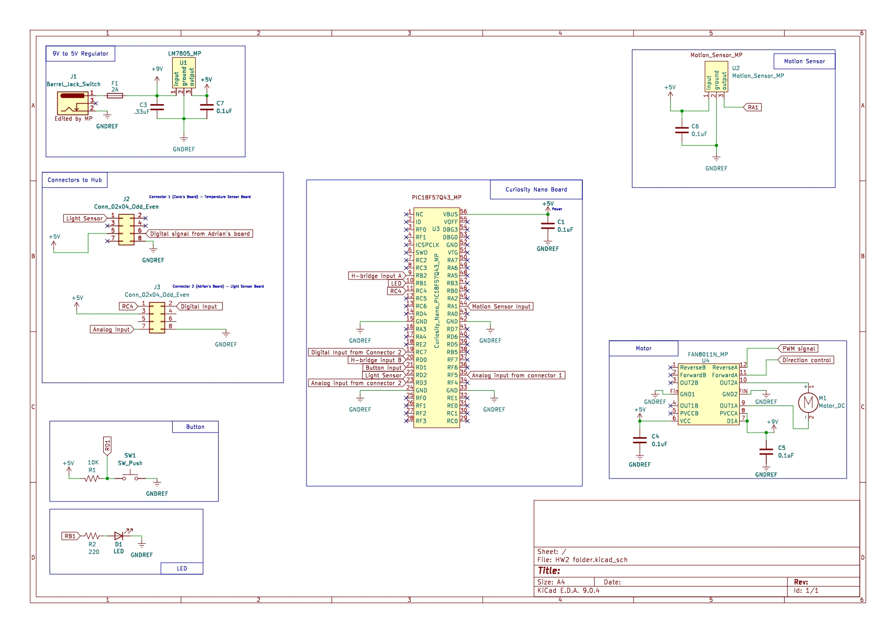

## Individual Subsystem Schematic

This schematic shows the complete design for my Smart Curtain subsystem. It includes the Curiosity Nano microcontroller board, LM7805 power supply, motion and light sensors (with op-amp signal conditioning), H-bridge motor driver, user button, debug LED, and all required connectors. The schematic demonstrates all power, signal, and control connections needed for reliable operation and integration with the team system.

**Figure ##:** Smart Curtain Subsystem Schematic

---

### Downloadable Files

- **Project ZIP:**  
  [Download KiCad Project ZIP](HW2folder_MP.zip)

- **Symbol Library ZIP:**  
  [Download Symbol Library ZIP](Voltage_regulator_symbol.zip)

- **Schematic Image:**  
  

- **Schematic PDF:**  
  [Download High-Resolution Schematic PDF](HW2folder.pdf)

---

### Functional Discussion

The Smart Curtain Controller schematic is designed to automate curtain movement using sensor data, manual control, and motor actuation. The main controller is the PIC18F57Q43 Curiosity Nano, which reads signals from different sensors and controls the motor through an H-bridge circuit. This setup allows the system to decide when to open or close the curtain based on environmental conditions or user input.

Power for the circuit comes from a 9 V source that passes through an LM7805 voltage regulator to produce a stable 5 V supply. The 5 V line powers the microcontroller, sensors, and logic circuits, while the 9 V rail powers the motor and H-bridge. Decoupling capacitors are placed near the regulator, MCU, and H-bridge to reduce noise and prevent voltage drops when the motor switches direction or speed.

The motion sensor is connected to the RA1 pin on the microcontroller and outputs a digital signal whenever movement is detected. This allows the controller to trigger the curtain motor when someone enters or leaves the room. There is also a push button connected to a digital input that gives manual control of the curtain. A small red LED is included for debugging and system feedback, showing when the motor or sensors are active.

The FAN8011N H-bridge driver controls the DC motor that moves the curtain along the rod. It takes two control signals from the microcontroller: a PWM signal to set motor speed and a direction control signal to switch between opening and closing. This setup provides full control of the curtain movement in both directions and allows smooth transitions.

Two 8-pin connectors are used to interface with my teammates’ boards. Connector 1 is linked to Zane’s board and carries analog input data from his DAC output into one of my ADC pins. Connector 2 connects to Adrian’s board and carries analog signals from his photoresistor and potentiometer, along with a few digital connections. These inter-board connections make it possible for my system to respond to environmental changes detected by the other boards, like light or temperature.

Test points are added on important lines such as the 5 V power, ground, sensor outputs, and motor control pins. These points help during testing and troubleshooting since they let me measure voltage and signals directly without disconnecting any components.

Overall, this schematic combines sensing, control, and actuation into one functional design. It meets the project goals by allowing both automatic and manual curtain control while staying compatible with the team’s larger system.