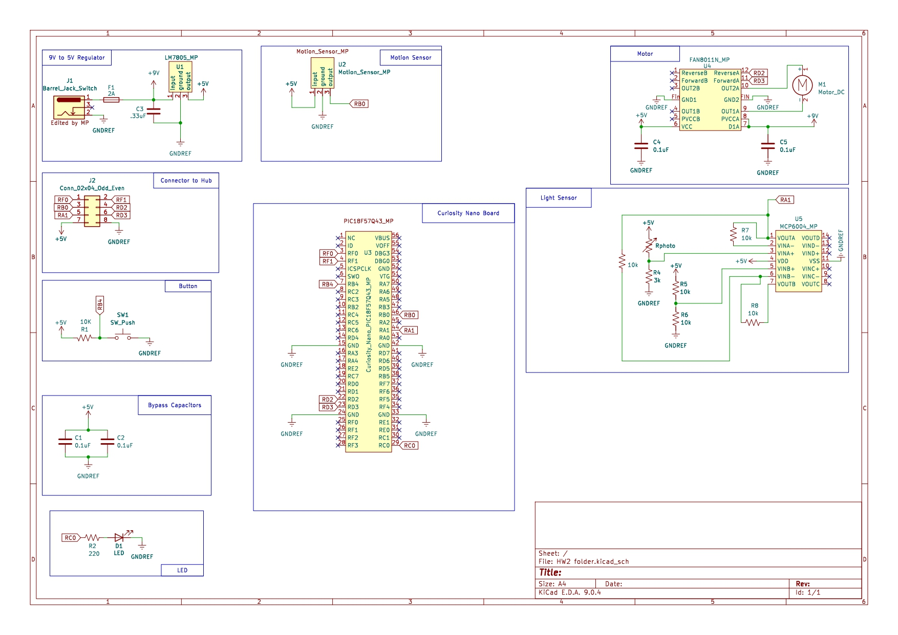

## Individual Subsystem Schematic

This schematic shows the complete design for my Smart Curtain subsystem. It includes the Curiosity Nano microcontroller board, LM7805 power supply, motion and light sensors (with op-amp signal conditioning), H-bridge motor driver, user button, debug LED, and all required connectors. The schematic demonstrates all power, signal, and control connections needed for reliable operation and integration with the team system.

**Figure ##:** Smart Curtain Subsystem Schematic

---

### Downloadable Files

- **Project ZIP:**  
  [Download KiCad Project ZIP](HW2folder_MP.zip)

- **Symbol Library ZIP:**  
  [Download Symbol Library ZIP](Voltage_regulator_symbol.zip)

- **Schematic Image:**  
  

- **Schematic PDF:**  
  [Download High-Resolution Schematic PDF](HW2folder.pdf)