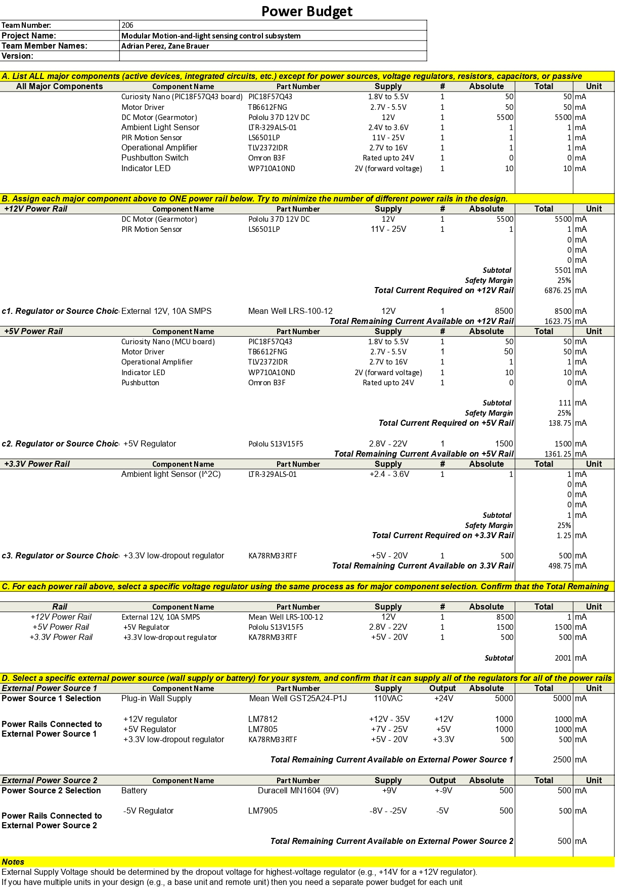

# Power Budget

This page presents the Power Budget for the system design, ensuring that all voltage rails, regulators, and power sources can reliably meet the required current demand for every subsystem.

---

## Overview

The Power Budget includes:
- Power requirements of all major components (from datasheets).  
- Assigned voltage rails and current draws.  
- Regulator and source selections with safety margins.  

---

## Power Budget Table

  

---

## Power Rails and Regulators

| **Power Rail** | **Regulator / Source** | **Part Number** | **Output Voltage** | **Max Current (mA)** | **Notes** |
|----------------|------------------------|------------------|--------------------|----------------------|------------|
| +12V | Linear Regulator | LM7812 | +12V | 1000 | Powers DC Motor and PIR Sensor |
| +5V | Linear Regulator | LM7805 | +5V | 1000 | Powers PSoC, Op-Amps, and Sensors |
| +3.3V | LDO Regulator | KA78RM33RTF | +3.3V | 500 | Powers BLE and logic components |
| -5V | Negative Regulator | LM7905 | -5V | 500 | Powers dual-supply Op-Amps |
| External Source | Wall Adapter | Mean Well GST25A24-P1J | +24V | 5000 | Primary source for positive rails |
| Battery Source | 9V Battery | Duracell MN1604 | ±9V | 500 | Supplies power to negative rail |

---

## Battery Life Estimation

Estimated battery life for the -5V rail (9V, 500mAh battery):

> **≈ 1 hour under continuous full load.**

This represents a worst-case scenario with all active components operating simultaneously.

---

## Reflection

Developing the Power Budget provided valuable insight into the power flow, efficiency, and safety of the system.  
Key takeaways:
- Verified each regulator’s load capacity and dropout margin.  
- Identified the DC motor as the highest power consumer.  
- Confirmed that the +24V wall adapter supports all rails simultaneously.  
- Ensured safe and efficient voltage regulation across all subsystems.  

This analysis guarantees that the overall design maintains electrical reliability and stability during operation.

---