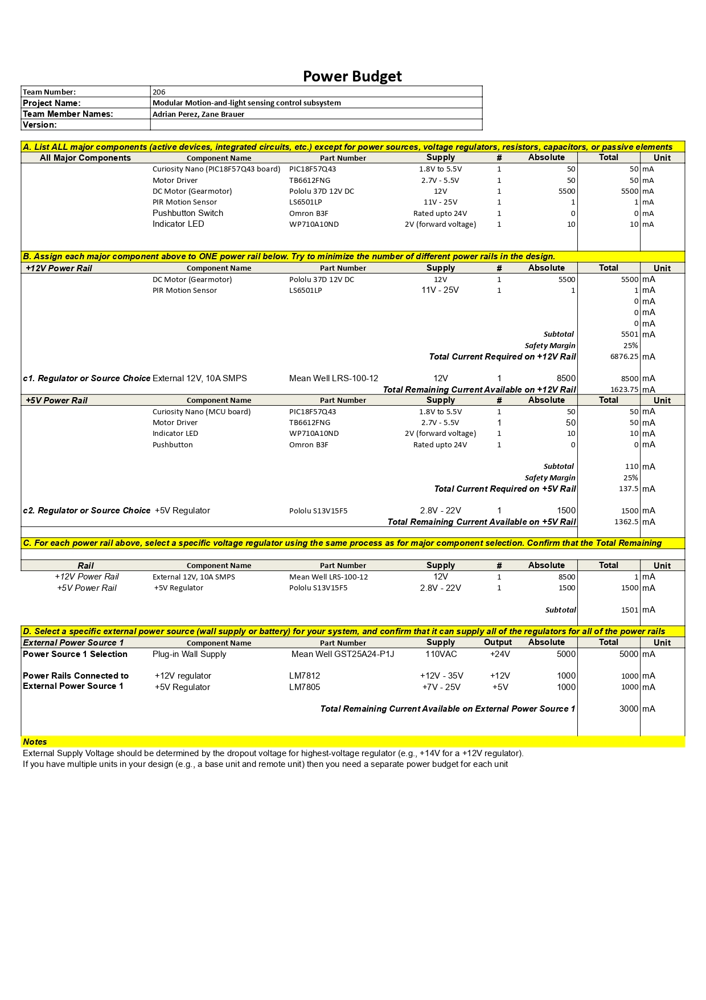

# Power Budget

This page presents the Power Budget for Mihir Patel’s Smart Curtain Control subsystem, verifying that all voltage rails, regulators, and the selected power supply can reliably meet the total current demand for every component.

---

## Overview

The Power Budget includes:
- Power requirements of all major components.
- Assigned voltage rails and current consumption.  
- Regulator and source selections with safety margins.  

---

## Power Budget Table

**Figure 03:** Smart Curtain Subsystem Power Budget

---

### Downloadable Files

- **Power Budget EXCEL:**  
[Download Power Budget (Excel)](PowerBudget_MP.xlsx)  

- **Power Budget ZIP:**  
[Download Power Budget (ZIP)](PowerBudget_MP.xlsx.zip)

- **Power Budget PDF:**  
[Download Power Budget (PDF)](PowerBudget_MP.pdf)

---

## Power Rails and Regulators

| **Power Rail** | **Regulator / Source** | **Part Number** | **Output Voltage** | **Max Current (mA)** | **Notes** |
|----------------|------------------------|------------------|--------------------|----------------------|------------|
| +5V | Linear Regulator | LM7805 | +5V | 1500 | All logic, control, H-bridge, motor loads |

> All major components, including the PIC18F57Q43 microcontroller, motion sensor (LS6501LP), op-amp (MCP6004), LED status indicators, H-Bridge (FAN8100N), and the Pololu 2371 DC Motor, are powered from a single +5V regulated supply, simplifying the distribution and improving reliability.
---

## Power Source Verification

| **Power Source** | **Part Number** | **Output** | **Max Current (mA)** | **Used (mA)** | **Remaining (mA)** |
|------------------|----------------|-----------|---------------------|---------------|-------------------|
| Wall Supply | Amazon B09ZTKTLGW | +9V, 3A | 5000 | 1469.25 | 3530.75 |

> The +9V adapter feeds the LM7805, supplying the entire 5V rail with ample overhead.

> No battery supply is needed for this subsystem.

---

### Power Budget Summary

This power budget directly accounts for the electrical demands of all system components, assigning each to a single 5V logic/actuator rail. Current estimates draw from worst-case scenarios and include a 25% safety margin. The external +9V wall adapter and LM7805 regulator are confirmed adequate for simultaneous operation of the microcontroller, peripherals, and DC motor.
No additional voltage rails or battery supply are required for normal operation. All design choices streamline power management while retaining headroom for expansion or peak loads.

---