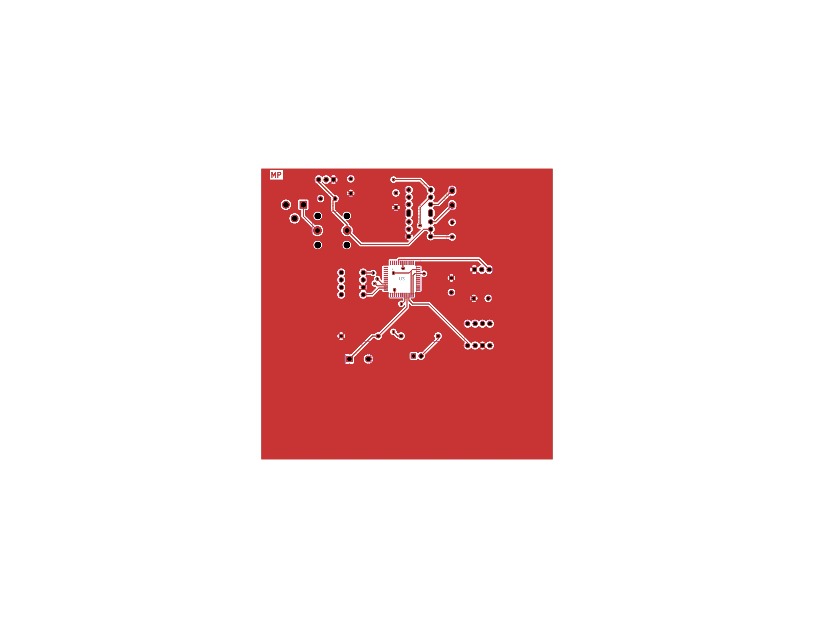
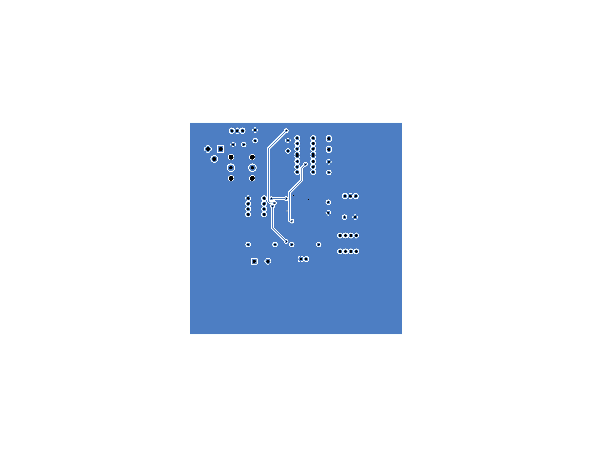

## Individual Subsystem PCB Design

This page contains all design files and documentation for the Smart Curtain Subsystem, including the PCB layout.
The system integrates sensors, a motor driver, and a microcontroller to automate curtain motion based on ambient light or user input.

**Figure 04:** Smart Curtain Subsystem PCB

**Figure 05:** PCB Top Layer View

**Figure 06:** PCB Bottom Layer View

---

### Downloadable Files

- **Project ZIP:**  
  [Download KiCad Project ZIP](HW2folderMP113.zip)

- **PCB Gerber Files ZIP:**  
  [Download PCB Gerber Files ZIP](PCB_gerber_files_MP.zip)

- **PCB PDF:**  
  [Smart Curtain PCB PDF](PCB_MP.pdf "Smart Curtain Subsystem PCB PDF")

- **PCB Top Layer Image:**  
  [Smart Curtain PCB Top Layer Image](PCB_MP_Frontlayer.jpg "Smart Curtain Subsystem PCB Top Layer Image")

- **PCB Top Layer PDF:**  
  [Smart Curtain PCB Top Layer PDF](PCB_MP_Frontlayer.pdf "Smart Curtain Subsystem PCB Top Layer PDF")

- **PCB Bottom Layer Image:**  
  [Smart Curtain PCB Bottom Layer Image](PCB_MP_Bottomlayer.jpg "Smart Curtain Subsystem PCB Bottom Layer Image")

- **PCB Bottom Layer PDF:**  
  [Smart Curtain PCB Bottom Layer PDF](PCB_MP_Bottomlayer.pdf "Smart Curtain Subsystem PCB Bottom Layer PDF")